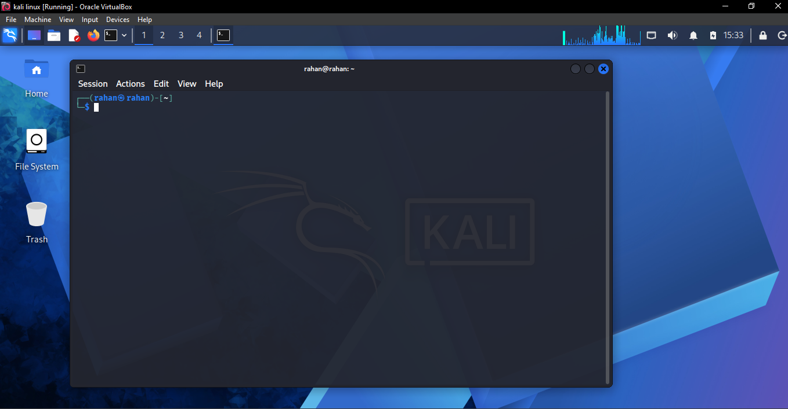
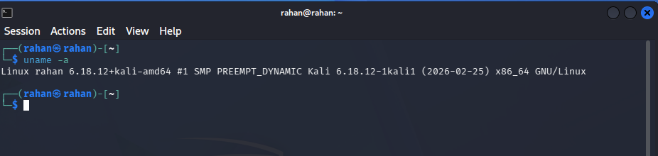
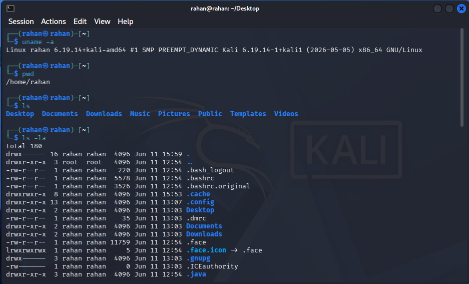
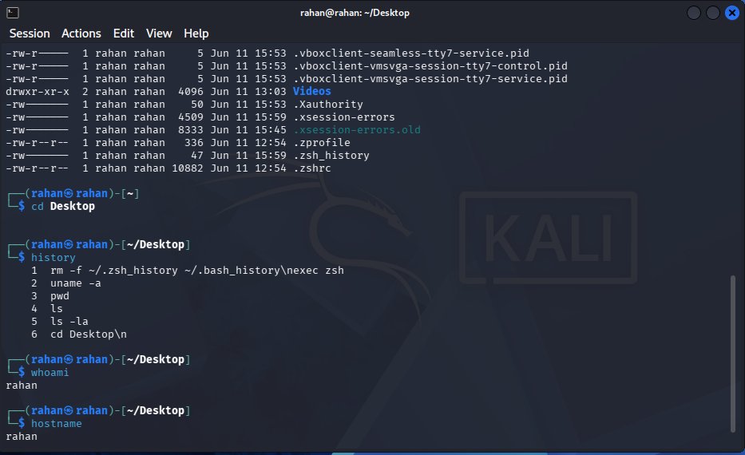
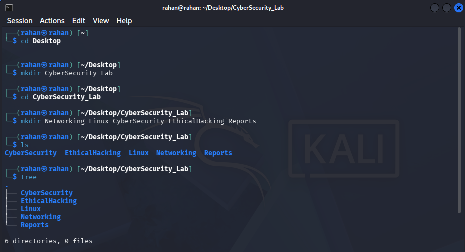
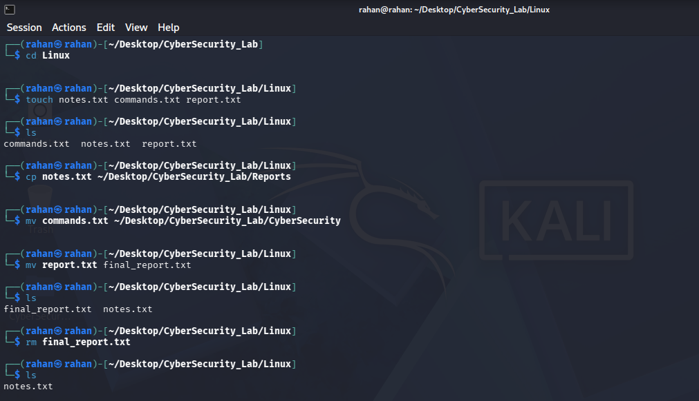
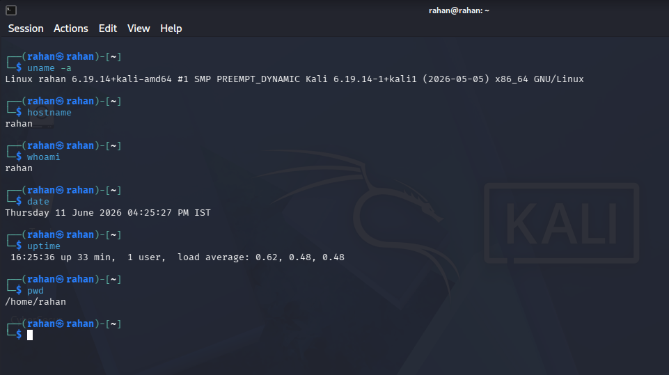

# Linux_Task_01_Rahan_Raj
The goal of this task was to get hands-on experience with the Linux operating system using Kali Linux.

**Intern Name:** Rahan Raj K R                
**Date:** June 2026  

---

## 📋 Table of Contents


- [Part A — Linux Installation & Verification](#part-a--linux-installation--verification)
- [Part B — Basic Navigation Commands](#part-b--basic-navigation-commands)
- [Part C — Directory Management](#part-c--directory-management)
- [Part D — File Management](#part-d--file-management)
- [Part E — System Information Collection](#part-e--system-information-collection)
- [Part F — Linux Research Activity](#part-f--linux-research-activity)
- [Key Learnings](#key-learnings)

---

## Objective

The goal of this task was to get hands-on experience with the Linux operating system using Kali Linux.  


---

## Part A — Linux Installation & Verification

**Tool Used:** VirtualBox  
**OS Installed:** Kali Linux 2026.05 

### Steps Followed:
1. Downloaded VirtualBox from [virtualbox.org](https://www.virtualbox.org)
2. Downloaded the Kali Linux pre-built VirtualBox image from [kali.org](https://www.kali.org/get-kali/#kali-virtual-machines)
3. Imported the `.ova` file into VirtualBox
4. Started the VM and logged in with credentials: `username / password` ( by default ) ` kali / kali`

### Screenshots:


| Screenshot | Description |
|------------|-------------|
|  | Kali Linux Desktop Environment |
|  | Terminal Window Open |
|  | System Information via `uname -a` |

---

## Part B — Basic Navigation Commands

All commands were run in the Kali Linux terminal.

| Command | Purpose | Output / Notes |
|---------|---------|----------------|
| `pwd` | Prints the current working directory | `/kali/kali` |
| `ls` | Lists files and folders in the current directory | Shows visible files |
| `ls -la` | Lists all files including hidden ones, with permissions and sizes | Shows dotfiles like `.bashrc` |
| `cd Desktop` | Changes the current directory to Desktop | Navigates into Desktop |
| `clear` | Clears the terminal screen | Screen becomes blank |
| `history` | Shows previously executed commands | Numbered list of commands |
| `whoami` | Displays the current logged-in user | `kali` |
| `hostname` | Shows the name of the machine | `kali` |

### Screenshots:
>


>


---

## Part C — Directory Management

Created the following folder structure under the home directory:

```
CyberSecurity_Lab/
├── Networking/
├── Linux/
├── CyberSecurity/
├── EthicalHacking/
└── Reports/
```

### Commands Used:

```bash
mkdir CyberSecurity_Lab
cd CyberSecurity_Lab
mkdir Networking Linux CyberSecurity EthicalHacking Reports
sudo apt install tree -y
tree ~/CyberSecurity_Lab
```

| Command | Purpose |
|---------|---------|
| `mkdir` | Creates a new directory |
| `cd` | Navigates into a directory |
| `tree` | Visually displays folder structure |

### Screenshot:
> 

---

## Part D — File Management

Files were created inside the `Linux` folder and then copied, moved, renamed, and deleted.

### Commands Used:

```bash
# Navigate to Linux folder
cd ~/Desktop/CyberSecurity_Lab/Linux

# Create files
touch notes.txt commands.txt report.txt

# Copy a file
cp notes.txt ~/Desktop/CyberSecurity_Lab/Reports/

# Move a file
mv commands.txt ~/Desktop/CyberSecurity_Lab/CyberSecurity/

# Rename a file
mv report.txt final_report.txt

# Delete a file
rm final_report.txt
```

### Command Summary:

| Command | Purpose |
|---------|---------|
| `touch` | Creates an empty new file |
| `cp` | Copies a file to another location (original stays) |
| `mv` | Moves or renames a file |
| `rm` | Permanently deletes a file |

### Screenshots:
>

---

## Part E — System Information Collection

### Commands Run & Output:

```bash
┌──(rahan㉿rahan)-[~]
└─$ uname -a
Linux rahan 6.19.14+kali-amd64 #1 SMP PREEMPT_DYNAMIC Kali 6.19.14-1+kali1 (2026-05-05) x86_64 GNU/Linux
                                                                                                                                                                       
┌──(rahan㉿rahan)-[~]
└─$ hostname
rahan
                                                                                                                                                                       
┌──(rahan㉿rahan)-[~]
└─$ whoami  
rahan
                                                                                                                                                                       
┌──(rahan㉿rahan)-[~]
└─$ date    
Thursday 11 June 2026 04:25:27 PM IST
                                                                                                                                                                       
┌──(rahan㉿rahan)-[~]
└─$ uptime  
 16:25:36 up 33 min,  1 user,  load average: 0.62, 0.48, 0.48
                                                                                                                                                                       
┌──(rahan㉿rahan)-[~]
└─$ pwd     
/home/rahan

```

### Recorded Information:

| Info | Value |
|------|-------|
| Kernel Version | ` 6.19.14-1+kali1 (2026-05-05) x86_64 GNU/Linux`  |
| Username | `rahan` |
| Hostname | `rahan` |
| Current Directory | `/home/rahan` |
| Date & Time | `Thursday 11 June 2026 04:25:27 PM IST` |
| System Uptime | `16:25:36 up 33 min,  1 user,  load average: 0.62, 0.48, 0.48` |

### Screenshots:
> > 

---

## Part F — Linux Research Activity

### 1. What is Linux?

Linux is a free and open-source operating system kernel first created by Linus Torvalds. It forms the core of many operating systems called "distributions" (like Ubuntu, Kali, parrot). Unlike Windows or macOS, Linux is open-source, meaning anyone can view, modify, and distribute its source code.

---

### 2. Why is Linux important in Cyber Security?

Linux is the backbone of the cybersecurity field for several reasons:
- Most web servers, cloud platforms, and network devices run on Linux
- Security tools like **Nmap**, **Metasploit**, **Wireshark**, and **Burp Suite** are built for Linux
- Linux allows deep system-level control, which is essential for penetration testing
- It supports powerful scripting (Bash, Python) to automate security tasks
- Kali Linux is a dedicated distro built specifically for ethical hacking

---

### 3. Difference Between Linux and Windows

| Feature | Linux | Windows |
|---------|-------|---------|
| Cost | Free and open-source | Paid license |
| Source Code | Publicly available | Closed/proprietary |
| Security | Fewer malware targets, more control | More targeted by attackers |
| Customization | Highly customizable | Limited |
| Command Line | Powerful and preferred | Available but less used |
| Usage | Servers, hacking, development | Consumer and business use |
| File System | ext4, xfs | NTFS, FAT32 |

---

### 4. What is a Linux Distribution?

A Linux distribution (or "distro") is a complete operating system built on top of the Linux kernel, bundled with software, a package manager, and a desktop environment.

**Examples:**
- **Kali Linux** — For penetration testing and ethical hacking
- **Ubuntu** — Beginner-friendly, general purpose
- **Parrot OS** — Lightweight, privacy and security focused
- **Fedora** — Developer-focused, cutting-edge packages
- **Debian** — Stable and widely used on servers

---

### 5. Why do Ethical Hackers Prefer Linux?

- **Full control** — Root access allows modification of any system component
- **Pre-installed tools** — Kali Linux comes with 600+ security tools out of the box
- **Lightweight** — Can run efficiently even on VMs with limited resources
- **Scripting power** — Bash and Python scripting automates repetitive hacking tasks
- **Privacy** — Linux doesn't send telemetry data like Windows does
- **Community** — Huge open-source community constantly building new security tools
- **Industry standard** — Most real-world targets (servers, IoT, cloud) run Linux

---

## Key Learnings

- Learned how to install and configure Kali Linux on VirtualBox
- Understood how to navigate the Linux file system using terminal commands
- Practiced creating and managing files and directories
- Collected system information using built-in Linux commands
- Understood the importance of Linux in cybersecurity and ethical hacking

---

## Tools & Environment

| Tool | Version |
|------|---------|
| Host OS | Windows 10 |
| VirtualBox | 7.2.8 |
| Kali Linux | 2026-05-05 |
| Terminal | Bash (default Kali shell) |

---

*This task is part of my cybersecurity internship. All work was done independently for learning purposes.*
